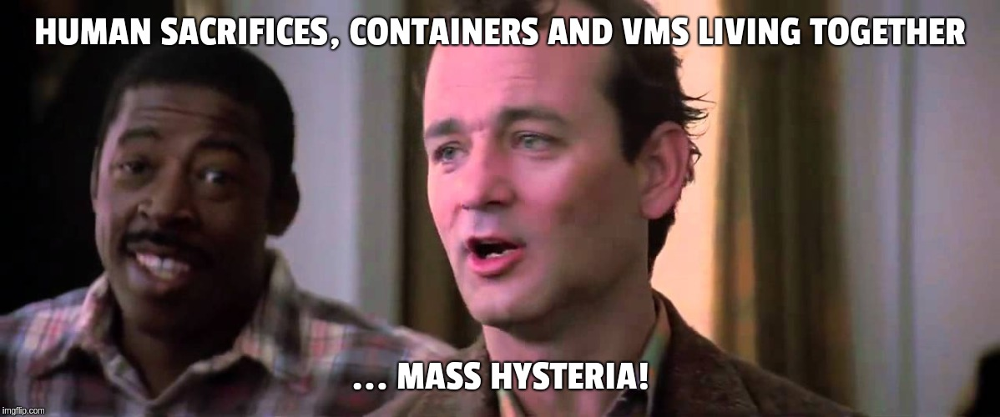

@title[Introduction]
## Kubevirt
##### VMs ~~or~~ and Containers, both manged by Kubernetes

---
@title[Whats your problem]
## We're running K8's and it's AWESOME!!!!
### But I've got these legacy VMs that I can't get rid of or migrate

@ul

- Not ready/able to rewrite my old applications
- I'm not touching those apps, they were written before I was born
- Sometimes I still want a VM

@ulend

Maintaining two infrastructure environments is a drag
So, why not just use K8's for "all the things"

---
## Running VMs and Containers in your K8s Cluster (crossing the streams)

---
## There are a number of folks doing this, with different approaches and goals

* Rancher VM
* Kata Containers
* Mirantis Virtlet
* Google gvisor

They're all good, just taking a different approach and solving specific problems

---
@title[Enter Kubevirt]
## Kubevirt focuses on the traditional Virtual Machine and a specific problem

**Bring my existing VMs to Kubernetes**

These VMs could be running in OpenStack, RHEV or VMware

Goal is to have this be as simple as `Import VM-Foo from My-VMware-Cloud`.... DONE!

---
@title[Philosophy]
@ul

- Unified platform to build, modify and deploy applications (Container or VM)
- BOTH VM workloads and Container workloads using the same automation, and K8s APIs
- Treat VMs just like any other K8's workload, while preserving the things you need from a VM
- VM becomes **just another POD**

@ulend
